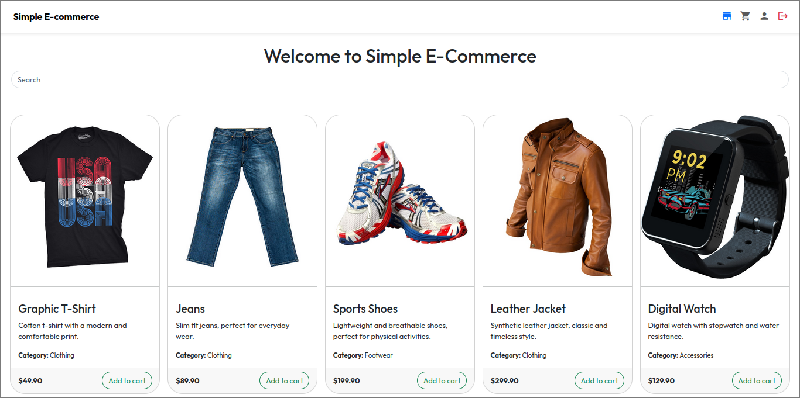
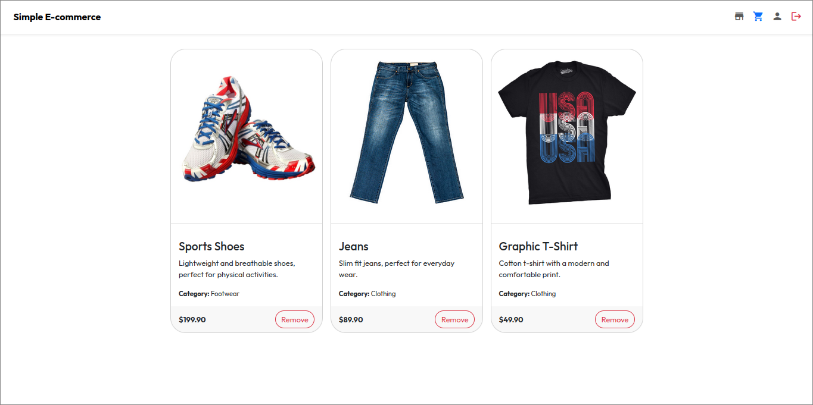

# Simple E-Commerce - CS50

A Simple E-Commerce project developed for CS50 2025 final project.

## Sumary

 - [Description](#description)
    * [Features](#features)
 - [Technologies](#technologies)
 - [Routes](#routes)
 - [Database](#database)
 - [Project gallery](#project-gallery)

---

## Description

A Simple E-Commerce is a web application developed using Flask, a Python micro-framework, for the CS50 2025 final project.

My objective with this project is to create a model for small applications where registered users can add products to their carts to purchase them later.

### Features

- Create an account
- Log in to an account
- Edit account details
- Delete account
- Add products to the cart for logged-in users

---

## Technologies

This section outlines all the technologies used in this project.

- **Front-End:**
    - HTML
    - CSS
    - Bootstrap
    - JavaScript

- **Back-End:**
    - Flask (Python Micro-Framework)
    - SQLite

---

## Routes

This section lists every route present in this project.

### GET & POST routes:

- `/`                   : Redirects to `/shop`
- `/shop`               : Show all products
- `/login`              : Show login page
- `/create_account`     : Show sign up page
- `/user`               : Show user profile page
- `/user/cart`          : Show all products in current user cart.

### POST-only routes:

- `/logout`             : Logout current user
- `/user/delete`        : Delete user account
- `/user/cart/add`      : Add product to user cart
- `/user/cart/remove`   : Remove product from user cart.

---

## Database

This project use **Flask-SQLAlchemy**, a wrapper for **SQLAlchemy ORM**.

The tables are defined in `src/models.py`.

### Tables

| Table      | Description                        |
|:-----------|:-----------------------------------|
| users      | Store all users                    |
| products   | Store all products                 |
| users_cart | Store all products in users carts  |


### users

Store all registered users.

| id | username | email          | password      | creation_date       |
|:---|:---------|:---------------|:--------------|:--------------------|
| 1  | Username | user@email.xyz | password_hash | 2025-01-01 00:00:00 |

### products

Store all products.

This table is initalized when the application is started. If you wanna **add another product**, edit the `products.json` following the model:

```json
{
    "name": "Product name",
    "description": "Product description.",
    "price": 100.00,
    "category": "Product category",
    "image_path": "images/products/product_file_name.jpg"
}
```

Unfortunatelly, to **remove some product** you have to **manually edit** `products.json` and `instance/database.db` deleting the item or dropping the `products` table.

| id | name         | description         | price | category         | image_path  |
|:---|:-------------|:--------------------|:------|:-----------------|:------------|
| 1  | Product name | Product description | 100.0 | Product category | path/to/img |

### users_cart

Store all products in users cart.

| id | user_id | product_id |
|:---|:--------|:-----------|
| 1  | 1       | 1          |

---

## Project gallery

### Shop


### Cart


### Edit user account


### Delete user account


### Login page


### Register page

